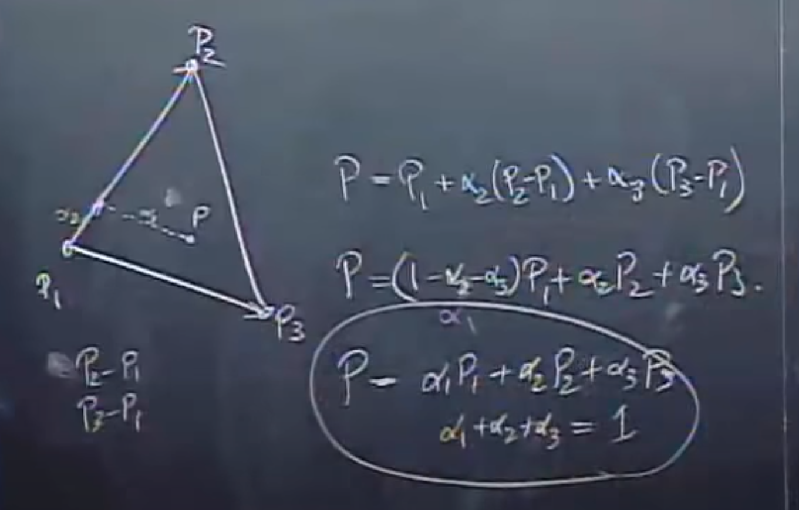
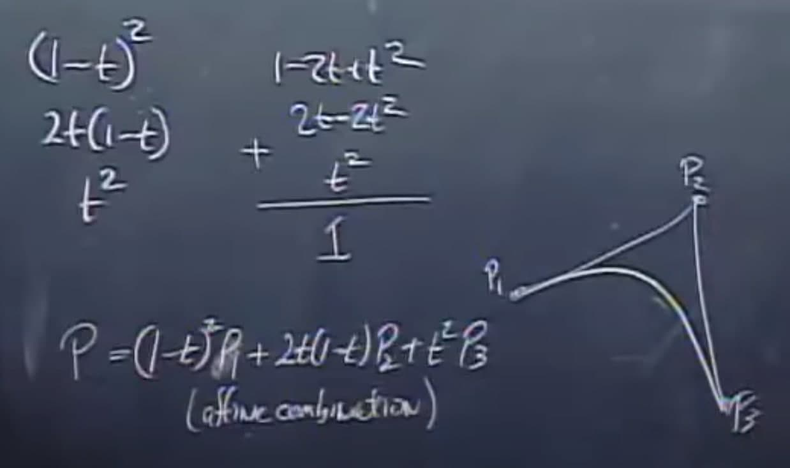
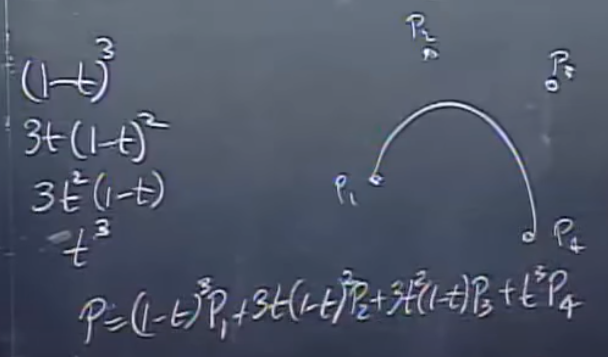

# Graphicsss - Readme and Notes

## --- How to compile ---

First of all, you need to download the [SFML Library](https://www.sfml-dev.org/).

If you're in Ubuntu, you could do something like this:<br>
> `sudo apt-get install libsfml-dev`<br>

If you're on Manjaro, you could try:<br>
> `yay -S sfml`

If you have any other distro, then you maybe could find how to install it [here](https://www.sfml-dev.org/download/sfml/2.5.1/).

If you're on Windows, well, good luck with that ¯\\\_(ツ)_/¯

## --- How to run ---

Just CD to the repo and run:<br>
>`g++ -o a graphicsss.cpp -lsfml-graphics -lsfml-window -lsfml-system && ./a`

## --- Vector Space ---

Some Basic Stuff:

* If v1 in VectorSpace and v2 in VectorSpace<br>
Then v3 = v1 + v2 is in VectorSpace

* If v1 in VectorSpace then k * v1 in VectorSpace

* All vectors are VectorSpaces 👀

* If you take a point and sum a vector, you'll get other point.<br>
p1 + v1 = p2

* If you take two points and substract them, you'll get a vector.<br>
v1 = p2 - p1

## --- Some Notes ---

If you have a vector v1,

v1 = p1-------p2 (v1 is a line between points p1 and p2)

Then: p1 + t*(p2 - p1), with t in ℝ<br>
Will give you all the points inside the vector v.

That ecuation can be simplified as follows:<br>
(1 - t) * p1 + t * p2

Note that t + (1 - t) always return 1, for any t in ℝ...

Those equations are called [Affine combinations](https://en.wikipedia.org/wiki/Affine_combination).

## --- Barycentric coordinates --- 

They're the position of a point inside a triangle.<br>
If p1, p2 and p3 are the triangle vertices, then any point within those 3 vertices can be represented as an affine combination of them, and their respective vectors (i.e (p2 - p1) and (p3 - p1), for example).

```
P = t1 * p1 + t2 * p2 + t3 * p3

where t1 + t2 + t3 = 1
```

This says that we can create any point inside a triangle as a combination of its points and vectors, like this, for example:



## --- Affine combinations ---

Let's take a point P within a triangle
```
P = t1 * p1 + t2 * p2 + t3 * p3
```
where t1 + t2 + t3 should be equal to 1

```
t1  =  (1 - t)^2
t2  =  2t * (1 - t)
t3  =  t^2

So, with any t we put, we get 1.

Finally:

P = (1 - t)^2 p1 + 2t * (1 - t) p2 + t^2 p3
```

With this technique, we can create curves, like this:



And if we add one more point, like if we have a square, for example, then:
```
P = t1 * p1 + t2 * p2 + t3 * p3 + t4 * p4
```
where t1 + t2 + t3 + t4 should be equal to 1

```
t1  =  (1 - t)^3
t2  =  3 * t * (1 - t)^2
t3  =  3 * t^2 * (1 - t)
t4  =  t^3

So, with any t we put, we get 1.

Finally:

P = (1 - t)^3 p1 + 3 * t * (1 - t)^2 p2 + 3 * t^2 * (1 - t) p3 + t^3 * p4
```



So, it's basically the same, but with one more point.

Note that we use the coefficients of the pascal triangle too xD.

We could keep going on and on with this...

## --- Resources ---

Its always a good thing to keep learning.<br>
Here are some helpful links:

[Computer Graphics Course - Ken Joy](https://www.youtube.com/playlist?list=PL_w_qWAQZtAZhtzPI5pkAtcUVgmzdAP8g)

[The Coding Train - Daniel Shiffman](https://www.youtube.com/user/shiffman)

[Algorithms List](https://en.wikipedia.org/wiki/Category:Computer_graphics_algorithms)